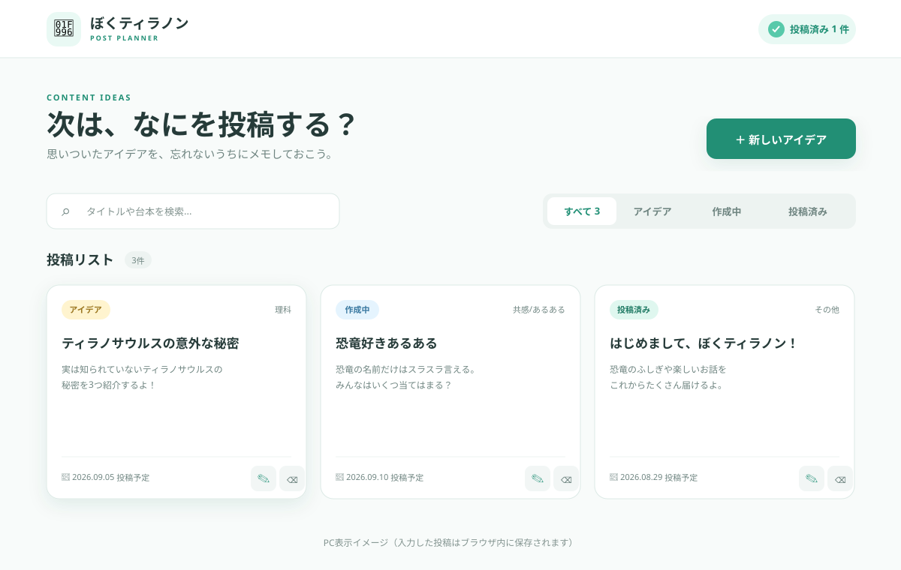

# ぼくティラノン 投稿管理アプリ

SNSアカウント「ぼくティラノン」の投稿アイデアを、ブラウザだけでかんたんに管理するWebアプリです。外部サービスや有料APIは使わず、データはお使いのブラウザの `localStorage` に保存します。

## 画面プレビュー



実際に操作するには、ダウンロードしたフォルダの [`index.html`](index.html) をダブルクリックしてください。アプリは追加インストールなしで開けます。開発環境では、次のコマンドでもプレビューできます。

```bash
python3 -m http.server 8000
```

コマンド実行後、ブラウザで [http://localhost:8000](http://localhost:8000) を開きます。

## できること

- 投稿アイデアの追加・編集・削除
- タイトル、ジャンル、投稿形式（リール・画像投稿・ストーリーズ）、ステータスの管理
- 台本、Instagram用キャプション、投稿予定日の記録
- 投稿済みコンテンツの再生数・いいね数・保存数の記録
- 今月の投稿目標と達成状況の表示
- トップ投稿、平均再生数、投稿形式別の平均再生数の分析
- キーワード検索とステータスによる絞り込み
- 投稿済み件数の自動集計
- スマートフォン・PCに対応したレスポンシブ表示

## 起動方法

### 初心者向け：次にすること

次の手順だけで、すぐに「ぼくティラノン」を使い始められます。

1. GitHubのページを開いている場合は、緑色の **Code** ボタンを押します。
2. **Download ZIP** を押して、ファイルをパソコンへ保存します。
3. ダウンロードしたZIPファイルを右クリックし、Windowsでは **すべて展開**、Macではダブルクリックして展開します。
4. 展開した `tiranon-app` フォルダを開きます。
5. 中にある **`index.html`** をダブルクリックします。
6. Chrome、Edge、Safari、Firefoxなどのブラウザで「ぼくティラノン」が開いたら準備完了です。
7. **新しいアイデア** ボタンを押し、タイトルを入力して **保存する** を押してください。

追加アプリのインストール、会員登録、APIキー、インターネット接続は必要ありません。次回も同じ `index.html` を開けば使えます。

> [!IMPORTANT]
> 投稿データは、開いたブラウザの中に保存されます。別のブラウザで開いた場合やブラウザの閲覧データを削除した場合は表示されません。普段使うブラウザを決めて利用してください。

### うまく開けない場合

- `index.html` ではなくZIPファイルの中を直接開いていないか確認してください。先にZIPを展開する必要があります。
- ファイルの種類を選ぶ画面が出たら、Chrome、Edge、Safari、Firefoxのいずれかを選んでください。
- 白い画面になる場合は、下記の「ローカルサーバーで起動する方法」を試してください。

### ローカルサーバーで起動する方法（開発者向け）

Python 3がインストールされている場合、このフォルダで次のコマンドを実行します。

```bash
python3 -m http.server 8000
```

ブラウザで [http://localhost:8000](http://localhost:8000) を開いてください。終了するときは、ターミナルで `Ctrl + C` を押します。

## 使い方

1. 右上の「新しいアイデア」を押します（スマートフォンでは見出しの下に表示されます）。
2. タイトルを入力し、ジャンルとステータスを選びます。
3. 必要に応じて台本、Instagram用キャプション、投稿予定日を入力します。
4. 「保存する」を押すと投稿リストに追加されます。
5. カード右下の鉛筆ボタンで編集、削除ボタンで削除できます。
6. 検索欄やステータスタブで、表示する投稿を絞り込めます。
7. ステータスを「投稿済み」にすると、再生数・いいね数・保存数を入力できます。
8. 画面上部の「目標数」を変更すると、今月の投稿数と進捗率が自動更新されます。投稿予定日が今月の「投稿済み」投稿が集計対象です。
9. 入力した実績は、画面下部の「投稿パフォーマンス」に自動集計されます。

## データについて

データはサーバーではなく、現在使用しているブラウザ内にのみ保存されます。同じ端末でも、別のブラウザやシークレットモードには引き継がれません。ブラウザの閲覧データを削除すると投稿データも消えるため、大切な内容は別途バックアップしてください。

## ファイル構成

- `index.html`：画面の構造
- `style.css`：デザインとレスポンシブ表示
- `app.js`：投稿の追加・編集・削除・保存などの処理
- `tests/app.test.js`：主要機能と既存データ互換性の自動テスト

## 動作確認

Node.jsが利用できる場合、次のコマンドで主要機能のテストを実行できます。

```bash
node tests/app.test.js
```
